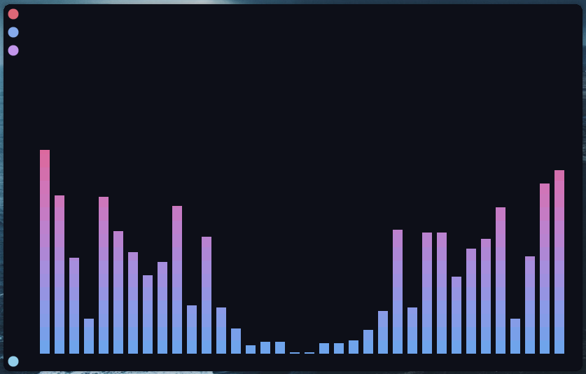

# Decay Cava

A decay port for cava by [tasty-laboratory](https://github.com/tasty-laboratory)



## Installation

```sh
# first clone the repository
git clone --depth=1 https://github.com/decaycs/cava ./decay-cava

# then go to the directory
cd decay-cava

# create the necessary folders if they aren't created yet
test -d ~/.config/cava || mkdir -p ~/.config/cava

# just copy the `config` file to the next location
cp -r ./config ~/.config/cava
```

Now, just enjoy! :P
