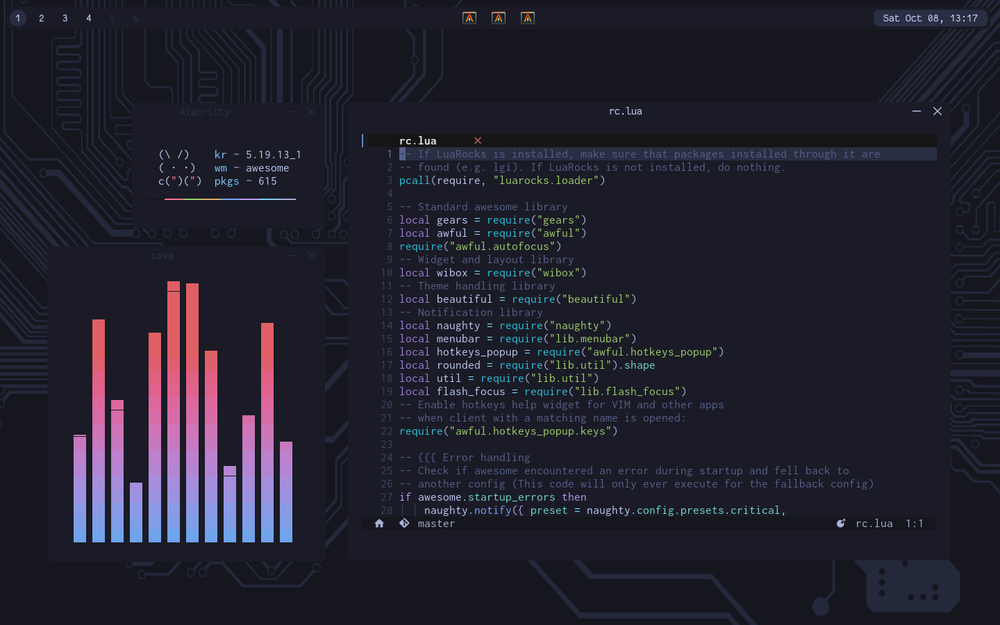

<h1 align="center">Dotfiles</h1>

<p align="center">
  
</p>

## Installation

- Suggested packages, just to make sure everything works properly

    ```
    awesome alacritty firefox bash nvim picom
    ```

</details>

- Clone the repo

  ```
  git clone https://github.com/hans3I/dots.git --depth=1
  ```

- Then link all the files to your home directory

</details>

## Usage [ Keybinds ] 
| Key                                  | Function                   |
| -----                                | -----                      |
| **[Software]**                       | **Function**               |
| Alt + p                              | screenshot(using scrot)    |
| Alt + d                              | launcher                   |
| Alt + Return                         | alacritty                      |
|                                      |                            |
| **[AwesomeWM]**                      | **Function**               |
| F1                                   | show keybindings           |
| Alt + s                              | toggle systray             |
| Alt + q                              | kill focused window        |
| Alt + e                              | toggle fullscreen          |
| Alt + space                          | toggle floating/tiling     |
| Alt + j/k                            | toggle window focus        |
| Alt + h/l                            | resize window              |
| Alt + [1-9]                          | focus desktop 1-9          |
| Alt + Shift + [1-9]                  | move window to desktop 1-9 |
| Alt + Shift + q                      | quit awesomewm             |
| Alt + Shift + r                      | restart awesomewm          |


## Project references
  - Colorscheme: [Tokyonight](https://github.com/folke/tokyonight.nvim)
  - Nvim: [Conscious](https://github.com/manas140/conscious)
