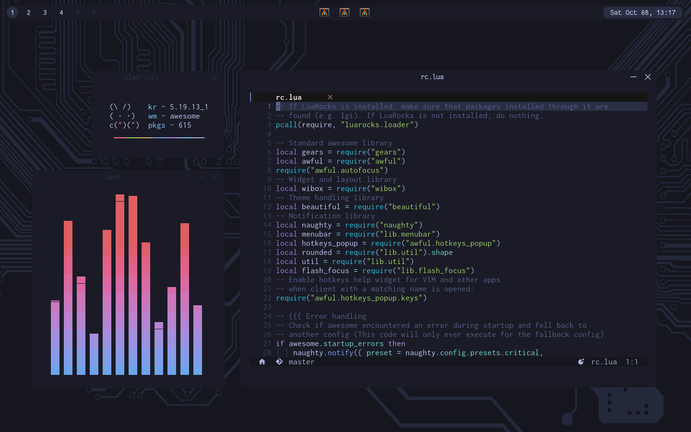
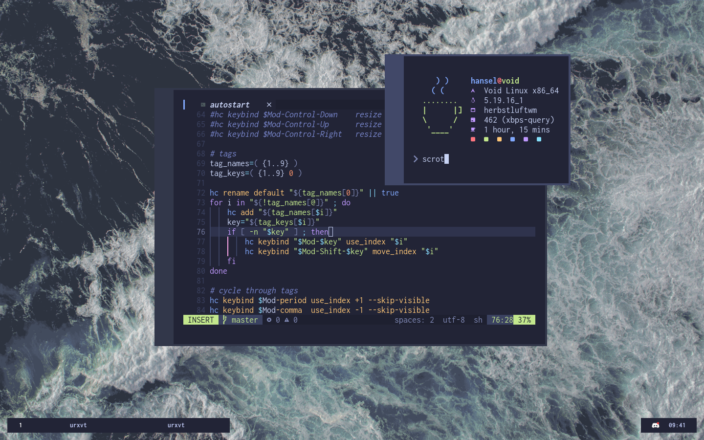

<h1 align="center">Dotfiles</h1>

## AwesomeWM preview
<p align="center">
  
</p>

## HerbstluftWM preview
<p align="center">
  
</p>

- Suggested packages, just to make sure everything works properly

    ```
    stow awesome berry bspwm herbstluftwm alacritty urxvt dunst starship tint2 worm firefox bash neovim picom xclip feh
    ```

</details>

- Clone the repo

  ```
  git clone https://github.com/hans3I/dots.git --depth=1
  ```

- Then link all the files to your home directory

</details>

## Usage [ Keybinds ] 
| Key                                  | Function                   |
| -----                                | -----                      |
| **[Software]**                       | **Function**               |
| Alt + p                              | screenshot(scrot & xclip)  |
| Alt + d                              | launcher                   |
| Alt + Return                         | alacritty / urxvt          |
|                                      |                            |
| **[AwesomeWM]**                      | **Function**               |
| F1                                   | show keybindings [awesome] |
| Alt + s                              | systray [awesome]          |
| Alt + q                              | kill focused window        |
| Alt + e                              | toggle fullscreen          |
| Alt + j/k                            | toggle window focus        |
| Alt + h/l                            | resize                     |
| Alt + [1-9]                          | focus desktop 1-9          |
| Alt + Shift + [1-9]                  | move window to desktop 1-9 |
| Alt + Shift + q                      | quit wm                    |
| Alt + Shift + r                      | restart wm                 |


## Project references
  - Colorscheme: [Tokyonight](https://github.com/folke/tokyonight.nvim)
  - Nvim: [Conscious](https://github.com/manas140/conscious)
  - Nvim: [nvim-basic-ide](https://github.com/LunarVim/nvim-basic-ide)
